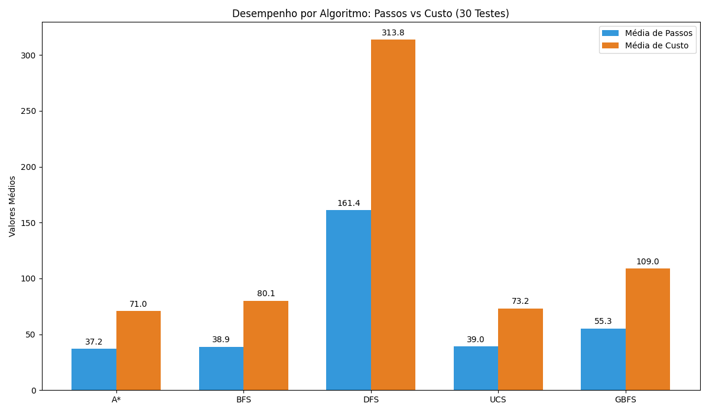

# Relatório Técnico: Comparativo de Algoritmos de Busca para Robô de Reflorestamento

**Objetivo:** Analisar o desempenho de diferentes algoritmos de busca aplicados ao problema do reflorestamento e justificar a seleção da abordagem.

---

##  Algoritmos Implementados e Testados

### 1. Busca em Largura (BFS)
No nosso problema, a BFS não atende ao problema completamente uma vez que ela ignora o peso das sementes, ela pode escolher um caminho curto em distância, mas extremamente caro em energia.

### 2. Busca de Custo Uniforme (UCS)

Encontra a solução ótima (melhor custo). No entanto, por ser uma busca cega, expande nós em todas as direções, o que consome mais memória e tempo de processamento.

### 3. Busca Gananciosa (Greedy)

 É rápida, mas míope. Essa abordagem leva em consideração apenas a heurística, podendo levar a um caminho caro no final. No contexto do problema, poderia levar o robô a situações onde ele planta todas as sementes longe da base e o caminho gerado fica caro para retornar e recarregar.

### 4. Algoritmo A* 

Esse algoritmo garante a otimalidade (menor gasto de energia) e é significativamente mais eficiente que o UCS, pois a heurística de Manhattan direciona a busca, reduzindo o número de nós explorados.

---

##  Justificativa de Algoritmos Não Utilizados

Para este projeto, certos algoritmos foram descartados por incompatibilidade com a estrutura do problema ou por falta de garantias de eficiência.

### 1. Busca Local: Hill Climbing (Subida de Encosta)
* **Por que não usar:** O Hill Climbing toma decisões baseadas apenas no vizinho imediato que parece melhor. No nosso caso, o agente ficaria preso em **mínimos locais**. 
* **Exemplo:** O robô pode chegar ao lado de uma cova, mas estar sem sementes. O Hill Climbing não conseguiria "olhar para trás" e planejar uma rota de volta à base, pois qualquer movimento para longe da cova pareceria uma piora no estado atual.

### 2. Busca em Feixe (Beam Search)
A Beam Search é uma versão otimizada em memória que mantém apenas os $k$ melhores nós em cada nível. 
* **Problema:** Ela sacrifica a **completude**. No reflorestamento, o caminho para a solução pode exigir passar por estados que parecem "ruins" temporariamente (como voltar à base). A Beam Search poderia podar esses caminhos cruciais, fazendo o algoritmo falhar em encontrar qualquer solução, mesmo ela existindo. Ou seja, achar o k que deixe a busca consistente é complicado.

### 3. Algoritmos Evolutivos (Genéticos)

* **Problema:** Em um grid $10 \times 10$ perfeitamente conhecido (estático e determinístico), o esforço para gerenciar uma população, realizar crossover e mutação é computacionalmente muito superior ao de uma busca $A^*$. Além disso, são métodos probabilísticos, enquanto nosso problema exige uma solução exata e reproduzível.
Em resumo, o algoritmo é feito para usar em outro tipo de configuração de ambiente.

---

## 3. Conclusão Comparativa

A tabela abaixo resume a comparação do A* com as demais abordagens implementadas no projeto:

| Algoritmo | Garante Menor Custo? | Considera Peso ($g(n)$)? | Usa Heurística ($h(n)$)? | Desempenho Observado |
| :--- | :--- | :--- | :--- | :--- |
| **A\*** | **Sim** | **Sim** | **Sim** | **Ótimo:** Menor custo com busca direcionada. |
| **UCS** | **Sim** | **Sim** | Não | **Eficaz:** Custo ótimo, mas processamento lento. |
| **BFS** | Não | Não | Não | **Subótimo:** Poucos passos, mas alto custo. |
| **Greedy** | Não | Não | Sim | **Rápido:** Baixo processamento, mas rota imprevisível. |
| **DFS** | Não | Não | Não | **Ineficiente:** Rotas redundantes e custos altíssimos. |

### Evidência Gráfica
Abaixo, os dados extraídos do ambiente de teste que validam a superioridade do A* em relação ao custo energético acumulado.

**Escolha Final:** O **A*** foi mantido como o motor do agente por ser o único que respeita a física do problema (custo do peso) enquanto mantém a eficiência.